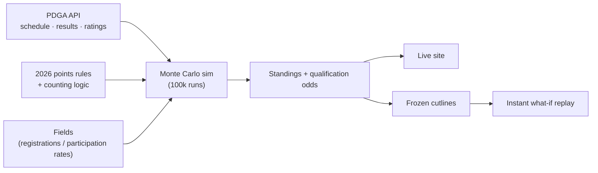

# DGPT Standings Forecast

**Live: [dgoodenough.github.io/discgolf](https://dgoodenough.github.io/discgolf/)** —
current standings, Powerball Cup qualification odds with per-position distributions,
and a what-if mode that recomputes a player's odds instantly as you toggle which
events they'll attend.

A Monte Carlo forecast of who makes the Powerball Cup (the DGPT Championship), and
at what odds. Inspired by
[FiveThirtyEight's sports forecasts](https://projects.fivethirtyeight.com/soccer-predictions/),
styled with [Ledger](https://github.com/dgoodenough/style).

## The problem

I'd listen to podcasts and live commentary all season and no one could ever tell the
story of who was actually in the hunt for a championship spot, because no one really
knew. The math was manual and easy to get wrong. The standings can also be
counterintuitive: a player with a string of good finishes might have their season
hinge not on their next result but on how many points they're at risk of *dropping*
under the best-finishes-count rule. That's the kind of thing I wanted at my
fingertips, and it didn't exist.

## Who it's for

The disc golf media and analytics community first, the people telling the tour's
story who could use real numbers behind it. But it's built to be useful to anyone
following along who wants to know where their favorite player really stands.

## What I built

A live model of the Pro Tour standings that turns "who's in the hunt?" into an
actual probability for every player, updated automatically off the PDGA API. The
site shows current standings and each player's odds of qualifying, broken down by
finishing position. The what-if mode is the part I'm happiest with: toggle which
remaining events a player will enter and their odds recompute in under a tenth of a
second, so you can see a scheduling decision's cost in real time.

## Key product and technical decisions

- **Keep the model simple on purpose.** I could have spent forever mining stats for
  a cleverer skill signal. For *this* question it wouldn't have mattered. What moves
  the answer most is the binary of who's registered for which events, and PDGA
  ratings are a perfectly good stand-in for current skill. Getting the scope right
  mattered more than getting the model fancy.
- **Instant what-if via cutline replay.** Rather than re-run the whole simulation in
  the browser, the model freezes 25,000 per-sim qualification cutlines from the full
  run, and the browser re-scores just the selected player against them. That's real
  distributional math at under 100ms per toggle, validated within about 2 points of
  the full model across the odds spectrum.
- **Rebuild on the PDGA API so it stays current.** The original ran on hand-pulled
  CSVs. The 2026 version pulls schedule, results, and ratings from the PDGA API so it
  refreshes on its own instead of needing me in the loop.
- **Match the source of truth exactly.** The points engine implements the full
  2025/2026 rules (class multipliers, tie averaging, best-14 counting, major caps,
  event-specific exceptions). Computed standings match StatMando's official totals
  exactly for all ~500 MPO and FPO players. If the standings didn't tie out, the odds
  wouldn't be worth much.

## How it works



Each run draws a field for every event, simulates round scores from player ratings
(`-(rating - field_avg) / 6` strokes per round, σ = 6.82, the same core as the 2021
model), awards points, applies the counting rules on top of banked points, and
tallies final standings. Full detail on the points system, field projection, and
qualification math is below.

## Impact

Two things I couldn't do before this existed:

- **Trustworthy numbers.** Standings tie out to the official totals exactly across
  ~500 players, so the odds on top of them are credible rather than a toy.
- **Stories that otherwise go untold.** When a top name slips to worse-than-even
  odds of making the Cup, or a player's choice to enter a non-tour event two weeks
  out could quietly cost them a qualifying spot, that's a story, and it usually goes
  unsaid because nobody had the numbers. Now they're a click away.

## V2 roadmap

The model is live and ties out; next is depth. *(Draft priorities, open to reordering.)*

- Make simultaneous multi-player what-if edits exact. Today each player is scored
  against cutlines that don't know about the others, so single-player scenarios are
  right but multi-player ones are directional.
- Model the full playoff-alternate qualification path so the field-size number is a
  real probability, not just an upper bound.
- Extend from championship odds toward full-season standings storytelling: a weekly
  "what's actually at risk" view.

## How it works, in detail

1. **Schedule** — pulled from the official PDGA REST API (`tier=ES` for Elite
   Series, `tier=M` for Pro Majors, plus JomezPro Series A-tiers).
2. **Results** — finishing places for completed events from PDGA's public
   live-scoring API, with DNF/WD detection.
3. **Points** — the 2025/2026 StatMando-administered points system: separate MPO/FPO
   per-place curves ([data/pointslogic](data/pointslogic/)), straight class
   multipliers (Elite ×1 → 150 for a win, DGPT+ ×4/3 → 200, Playoff ×5/3 → 250, Major
   ×2 → 300), tie groups averaging the points of the places they span, JomezPro flat
   bonuses (20/10/5 for 1st/2nd–5th/6th–10th), and the season counting rules: best 14
   finishes, top 2 majors counted (MPO 2-of-3, FPO 2-of-4), no FPO points at Heinola,
   the doubles-adjusted curve at the Preserve, and no points at the Powerball Cup or
   USDGC. Computed standings match StatMando's official totals exactly for all ~500
   MPO+FPO players (validated July 2026).
4. **Fields for future events** — manual overrides, else the real PDGA Live
   registration list when the event is within two weeks, else per-player
   participation rates from this season's starts (split US / Europe / JomezPro).
5. **Simulation** — each run draws a field per event, simulates round scores
   (σ = 6.82), ranks, awards points, applies the counting rules on top of banked
   points, and tallies final standings ranks.

Championship qualification: 32 MPO / 20 FPO play the Powerball Cup — top 28 / top 18
from standings plus playoff-performance alternates. The output reports both
`p_top28_standings` (direct qualification) and `p_top32` (field size, an upper bound
that ignores the MVP Open alternate path).

The what-if mode's cutline replay is exact in spirit for one player's multi-event
scenarios; simultaneous edits to many players are not, since each player is scored
against cutlines that don't know about the others.

Originally built for the 2021 season with hand-pulled CSVs (preserved in
[archive/2021](archive/2021/)); rebuilt in 2026 on top of the PDGA API.

## Usage

```
pip install -r requirements.txt
cp .env.example .env   # add your PDGA API credentials (developer access)
python -m dgpt.refresh --sims 100000
```

Outputs: `data/standings_{mpo,fpo}_2026.csv` (current standings) and
`results/2026/projections_{mpo,fpo}.csv` (qualification odds). To force a specific
player in/out of an event, add a row to `data/overrides/fields.csv`
(`tournament_id,pdga_number,plays`).

## Attribution

Event data © 2026 [PDGA](https://www.pdga.com) · Player data © 2026
[PDGA](https://www.pdga.com) · PDGA Authorized Developer. Per the
[PDGA developer program requirements](https://www.pdga.com/dev/developer-program),
every player name in the app links to the player's PDGA profile and every event name
links to its PDGA event page.

## Data sources

- [PDGA REST API](https://www.pdga.com/dev/api/rest/v1/services) (events, ratings;
  requires developer credentials)
- PDGA live-scoring API (results; public)
- [2026 points structure](https://www.dgpt.com/announcements/2026-points-structure/),
  [2025 standings structure](https://www.dgpt.com/announcements/2025-standings-structure/)
- [StatMando standings](https://statmando.com/rankings/dgpt/mpo) (validation only)

## License

[MIT](LICENSE).
